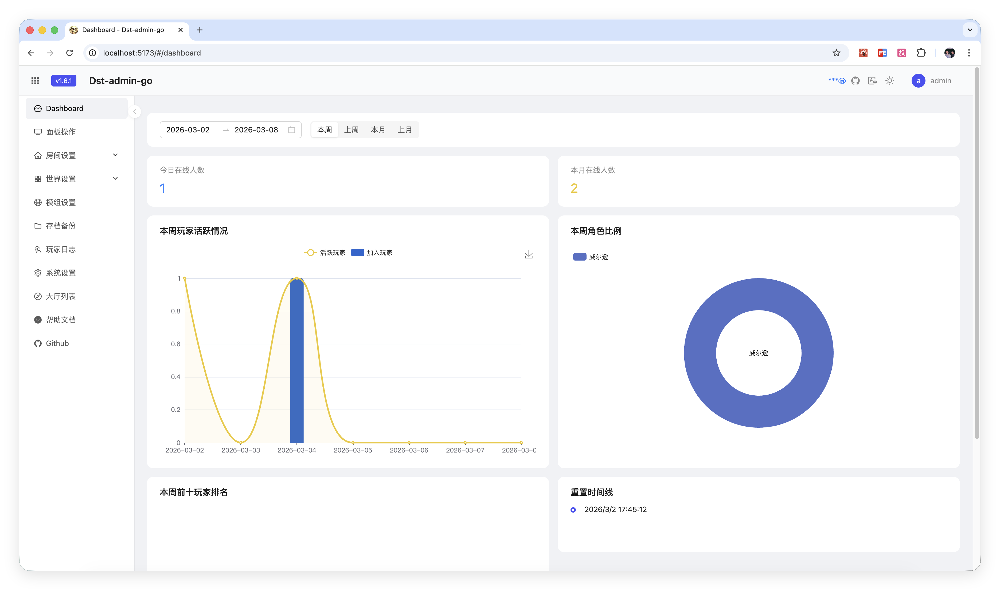
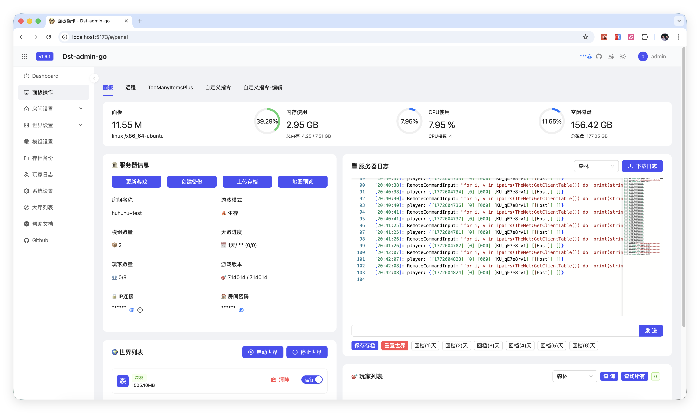
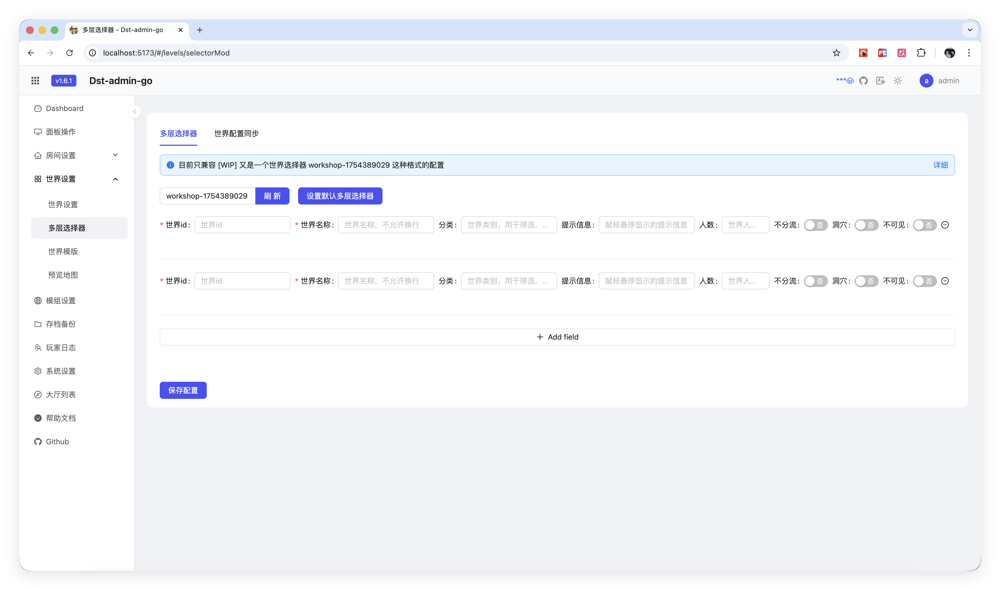
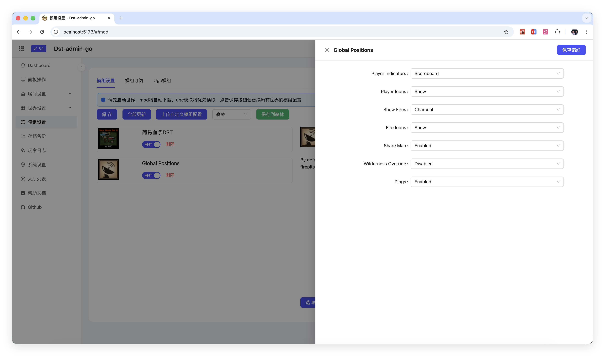
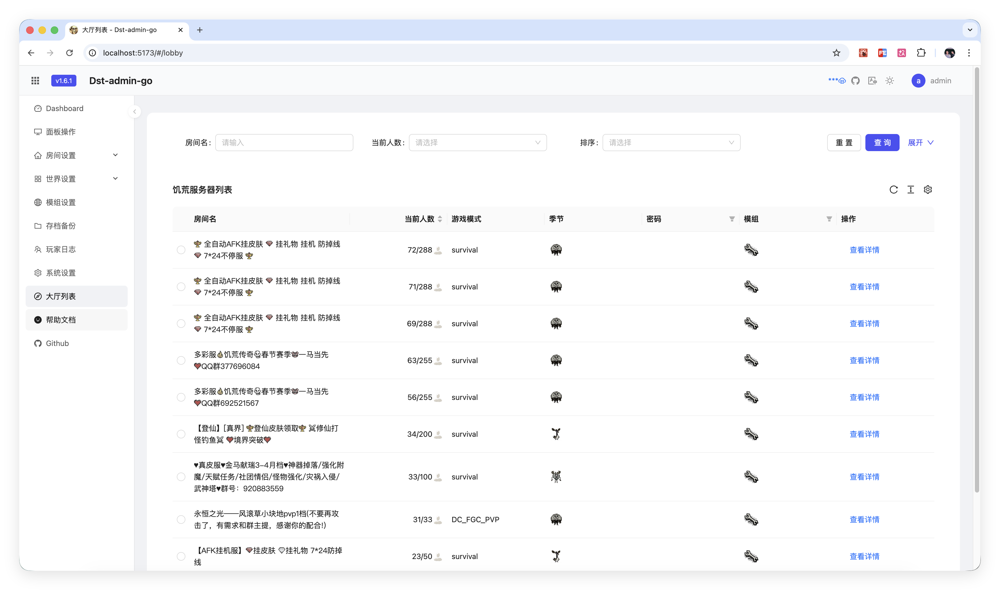

# dst-admin-rust
> 饥荒联机版管理后台

[English](README-EN.md)/[中文](README.md)

## 项目简介

**现已支持 Windows 和 Linux 平台**
> 注意：Windows Server 低版本系统请使用 1.2.8 之前的版本，高版本系统使用最新版本

DST Admin Rust 是一个使用 Rust 2024 迁移实现的《饥荒联机版》服务器管理面板，目标二进制：`dst-admin-rust`。它保持原面板的部署方式和 API 兼容面，具有以下特点：

- 🚀 **部署简单**：单个可执行文件，无需复杂配置，开箱即用
- 💾 **资源占用低**：基于 Rust 开发，内存占用小，运行高效
- 🎨 **界面美观**：现代化的 Web 界面，操作直观友好
- ⚙️ **功能完善**：
  - 可视化配置游戏房间和世界参数
  - 在线管理和配置 Mod（模组）
  - 支持多个集群（Cluster）和世界的统一管理
  - 游戏存档备份与快照恢复
  - 玩家管理（白名单、黑名单、管理员）
  - 实时日志查看和游戏控制台
  - 游戏服务器自动更新检测

## 部署
注意目录必须要有读写权限。

点击查看 [部署文档](docs/install.md)

## 预览












## 运行

**修改config.yml**
```yaml
#绑定地址
bindAddress: ""
#启动端口
port: 8082
#数据目录前缀
dataDir: "./data"
# wincli端口
dstCliPort: 8102
#数据库
database: dst-db
```

运行
```bash
cargo run --bin dst-admin-rust
```

## 打包

### Linux 打包

```bash
./tools/release/build-linux.sh
# 输出: dst-admin-rust (Linux amd64 二进制文件)
```

跨平台打 Linux 包时先安装目标并准备 linker：

```bash
rustup target add x86_64-unknown-linux-gnu
LINUX_LINKER=x86_64-linux-gnu-gcc ./tools/release/build-linux.sh
```

### Windows 打包

```bash
./tools/release/build-windows.sh
# 输出: dst-admin-rust.exe (Windows amd64 二进制文件)
```

Windows GNU 打包需要目标和 MinGW linker：

```bash
rustup target add x86_64-pc-windows-gnu
x86_64-w64-mingw32-gcc --version
./tools/release/build-windows.sh
```

### 直接构建当前平台二进制

```bash
cargo build --release --bin dst-admin-rust
```

## 前端开发

前端源码位于 `web-ui/`，使用 React、TypeScript、Vite 和 Ant Design。

常用命令：

```bash
cd web-ui
npm install
npm run dev
npm run test:unit -- --run
npm run build
```

生产构建输出到 `web-ui/dist/`，发布和 Docker 流程会把它打包到运行目录。

## QQ 群

